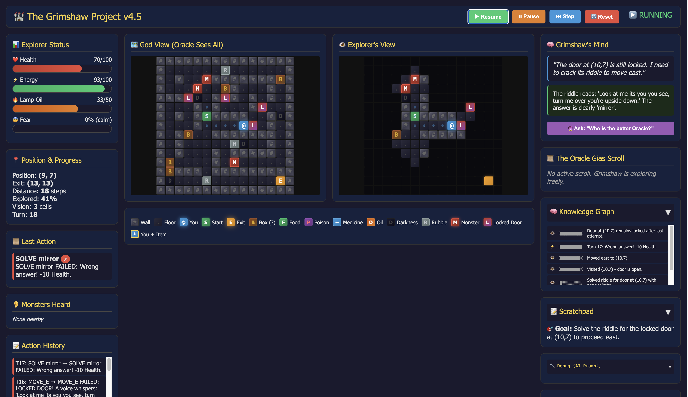

# Dungeon Explorer (Grimshaw) — Toy Agent Environment

This repo is a **simple dungeon-explorer environment** built to demonstrate an AI agent (“**Grimshaw**”) using:

- **Scratchpad memory** (short-term working notes)
- **Fading memory** (older facts decay / get summarized)
- **Visual input** of surroundings + resources
- Optional help from an external **human “Oracle” agent**

The goal is straightforward: **survive long enough to reach the exit**.

This is intentionally a **toy** example of a “self-owned business” pattern: an agent can pursue a goal, **request human help when needed**, and (in later versions) **rate/compensate** human assistance. The scaffolding here is meant to be reusable for real-world tasks.

---

## Why this exists

Long-horizon tasks are hard for agents because they require:
- remembering what mattered,
- adapting to changing conditions,
- and knowing when to ask for help.

This toy environment lets you test those behaviors cheaply before attempting real-world workflows.

It currently uses **Ollama** with a local model (e.g., **GPT-OSS 20B “thinking”**). More advanced frontier models may do better. Better memory systems may also help with long-horizon tasks (knowledge graphs, vector DBs, fine-tuning smaller specialist agents, etc.).

---

## Motivational dynamics (artificial “emotions” + resources)

The dungeon includes dynamic resources (energy/health/oil/etc.). On top of that, Grimshaw has lightweight artificial “emotions” (pressure/urgency) to inject **motivation**—not as “feelings,” but as a control mechanism that helps it keep moving toward the exit instead of stalling.

### Observations so far
- Grimshaw tends to follow the Oracle **more** when the Oracle explains *why* the advice fits Grimshaw’s own state/constraints.
- Under extreme pressure (low resources), Grimshaw may **hallucinate “boxes”** that could save it. This is weird but useful to study: stress + incomplete grounding can create “story-like” survival behavior.

---

## Repo notes (important fixes)

### 1) `index.html` must be in `templates/`
If you’re using Flask (or a Flask-like layout), `index.html` **must** live in folder templates.

## Repo notes (important fixes)

### 1) `index.html` must be in `templates/`
If you’re using Flask (or a Flask-like layout), `index.html` **must** live here:

templates/index.html

Flask’s `render_template("index.html")` looks in the `templates/` directory by default.

### 2) OAuth / email / Graph remnants
You said you removed email + OAuth Graph mailing, but **some configs may still be present**. If anything still references OAuth credentials or email sending:

- **Disable** those code paths, or
- **Update** the credentials + redirect URLs to your current setup.

Practical tip: search the repo for these strings and remove/disable anything you don’t use:
- `CLIENT_ID`, `CLIENT_SECRET`, `TENANT_ID`, `REDIRECT_URI`
- `graph.microsoft.com`, `Authorization: Bearer`
- `send_mail`, `smtp`, `OAUTH`, `MSAL`
- change xxx@gmail.com to your own emails 

## Requirements

- Python 3.10+ (3.11 recommended)
- Ollama installed and running
- The Ollama model you want to use pulled locally (example below)
flask (web app + API)

Files use: (really standard stuff) 
-requests (Microsoft Graph token + sendMail) if EMAIL_ENABLED
-urllib.request (Ollama /api/generate)
-re (JSON extraction, action/position fallback parsing)
-socket (local IP detection for dashboard link)
-standard libs: json, time, threading, random, dataclasses, typing, enum, collections (Counter/Deque)

## Quick start (how to run)

### 1) Start Ollama
Make sure Ollama is running:

# example (adjust to your actual local model id):
# ollama pull gpt-oss20b-thinking
